# 简介
基于树莓派pico做的电压故障注入提取apple airtag设备

1.1 攻击硬件便宜，成本在100人民币左右

1.2 使用树莓派pico，支持python

1.3 对airtag实现免焊接，只需要对好位置

# 文件目录说明

## hardware：

 硬件目录

pico_mini_V1.3.zip是生产文件，直接放立创pcb就能生产

bom文件夹是零件bom

Schematic_airtag.pdf是原理图

## code ：

代码目录

adc.py单独测试adc功能代码

glitch.py 单独测试电压故障注入的代码

thread.py 多线程攻击代码，机和了电压注入攻击和adc取样代码。

## 焊接说明

### 电压毛刺攻击需要焊接的部分

可控电源部分，这部分都要焊接

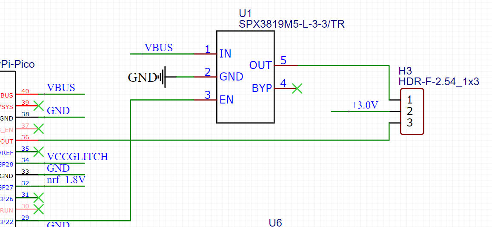

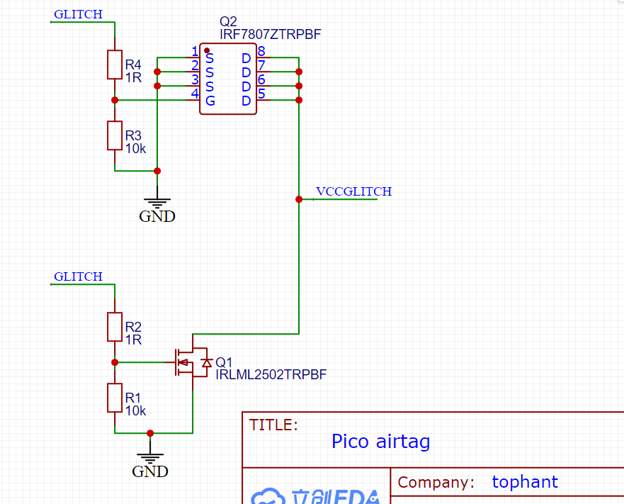

这里只需要焊接Q1

### u1 spiflash读取

使用pico读取spiflash需要焊接电源，主要是我们在测试的过程中发现，给整个airtag供电一段时间后，spiflash的供电就断开了，应该是处于低功耗考虑。如果我们使用airtag的供电读取spiflash，会出现读取到一半就无响应，所以这边使用了一个独立供电来给spiflash供电。也是可以通过pico的gpio进行控制。

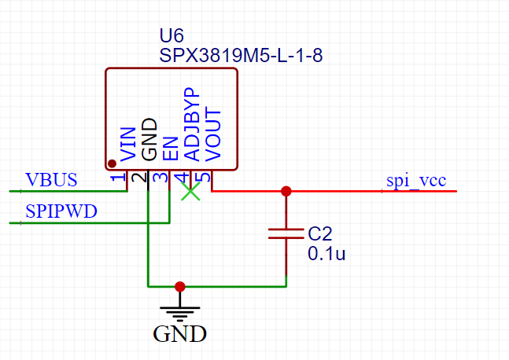

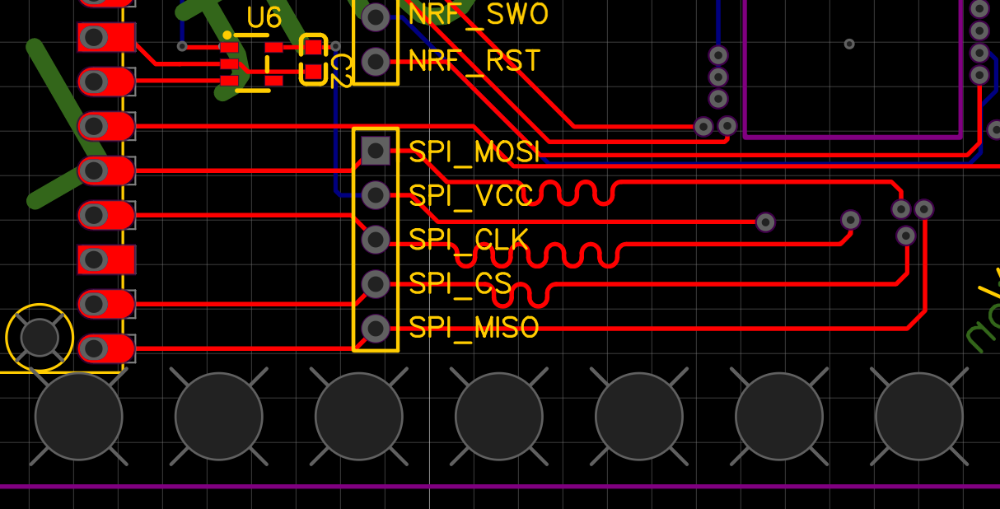

### swd调试（未验证）

用pico模拟swd 需要补上R5、R6电阻、如果外接swd编程器不需要焊接

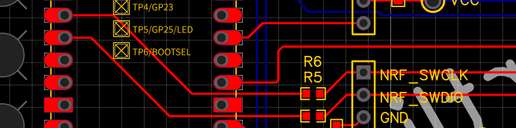

# 焊接后测试说明

底部触点使用pogopin，用于连接airtag，免去焊接的问题。

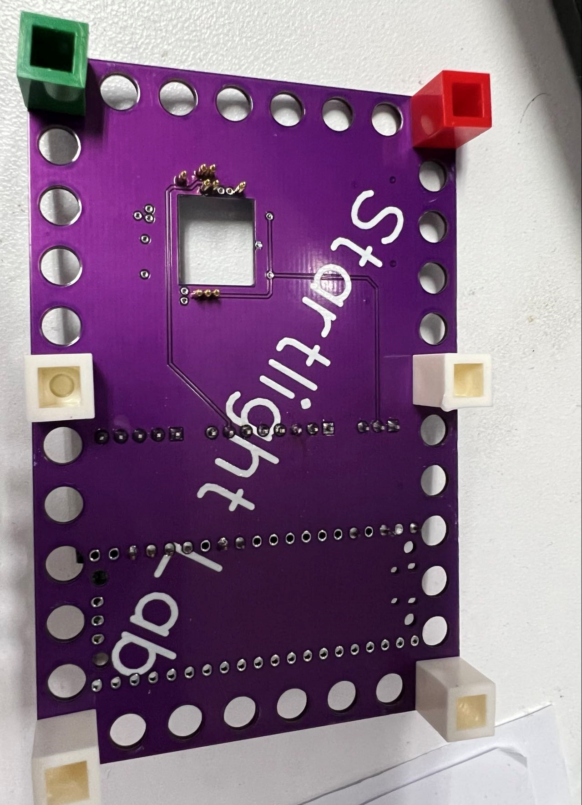

使用标准的lego小颗粒底板和乐高单颗粒就能连接airtag和攻击板

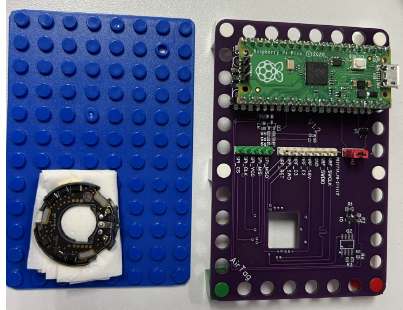

使用镊子移动airtag对其触点

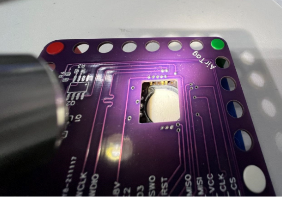

拔掉pico后测量对地阻值保证每个点都接触良好

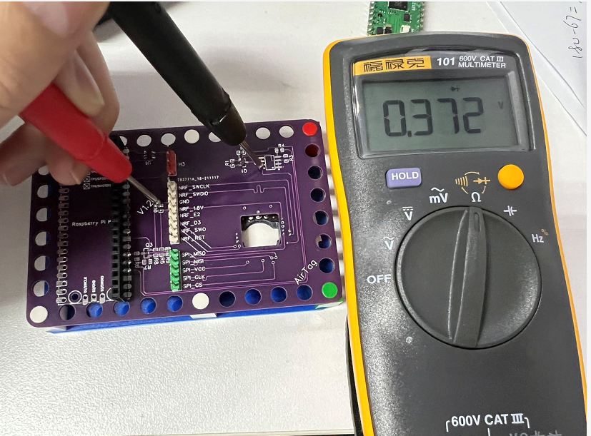

vcc是pico的供电3.0v电压。1.8v的点是nrf52的电压供电。vcore是nrf52的核心供电电压，也就是攻击点。

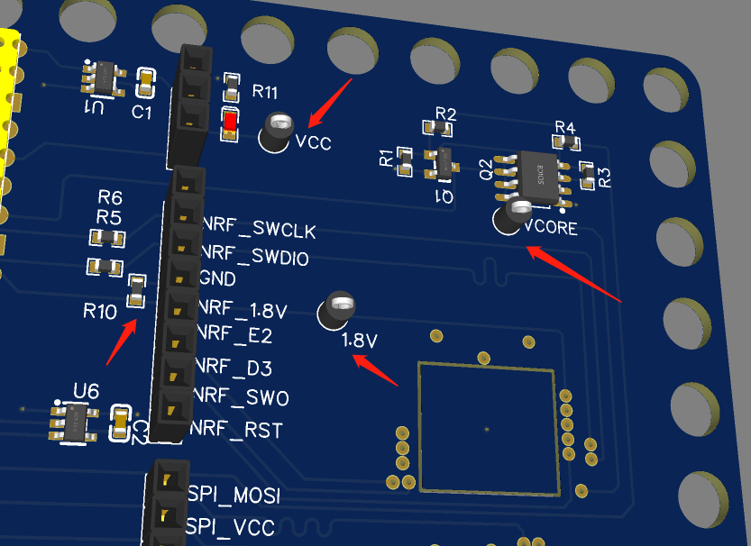

# 攻击流程

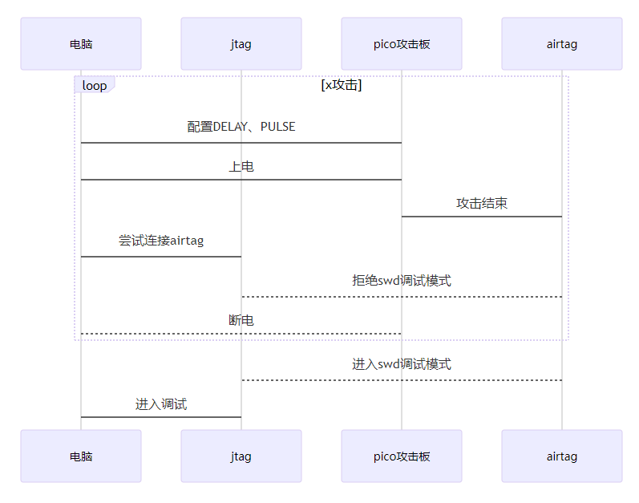
